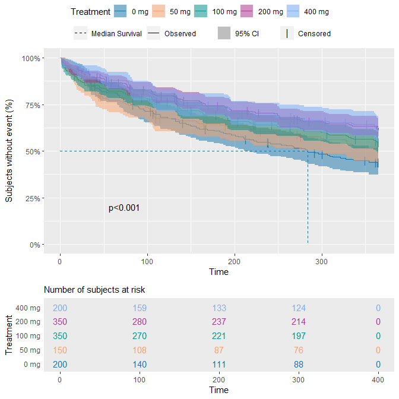

<!-- README.md is generated from README.Rmd. Please edit that file -->

# PMXtte

Support functions for (Repeated) Time-To-Event data analysis. Generate
summary tables and Kaplan-Meier plot for the exploratory analyses, and
visual predictive checks for model evaluation.

## Installation

You can install the development version of PMXtte from
[GitHub](https://github.com/) with:

``` r
# install.packages("devtools")
devtools::install_github("pharmetheus/PMXtte")
```

To get the latest stable release (including vignettes), please click the
appropriate link on the right side of the page. Download the file with a
name that starts with PMXtte. Install PMXtte with the `install.packages`
command, e.g.:

``` r
install.packages("path_to_release.tar.gz")
```

``` r
tte1data <- rttedata %>% filter_xth_event(1)
tte1data$TRTF <- factor(paste(tte1data$TRTN, "mg"), levels = paste(sort(unique(tte1data$TRTN)), "mg"))
ggKAP(
  tte1data,
  time_var = "TSFDD", 
  color_var = "TRTF", 
  label_color = "Treatment"
)
```


